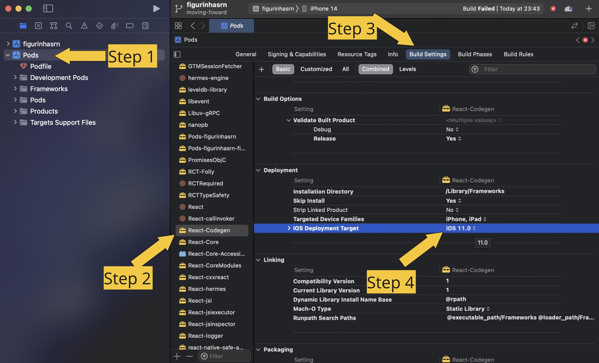

# React Native Starter Kit

Integrate with React Native SDK to guide how to use it

## Prerequisites

- NodeJS version 16.x or higher
- Ruby version 2.7.5 or higher

## Register an account on Kinde

To get started set up an account on [Kinde](https://app.kinde.com/register).

## Installing dependencies

You will need Node, the React Native command line interface, a JDK, Android Studio (for Android) and Xcode (for iOS).

Follow [the installation instructions for your chosen OS](https://reactnative.dev/docs/environment-setup) to install dependencies;

## Installation

Navigate into your project's root directory and execute the bash command shown below

```shell
# Install dependencies
$ npm install

# Install iOS native dependencies
$ cd ios
$ bundle install && bundle exec pod install
```

## Setup environments

You should change Kinde config in the `src/components/Header.tsx` file:

```javascript
new KindeSDK(
  'https://your_kinde_domain.kinde.com',
  'myapp://your_kinde_domain.kinde.com/kinde_callback',
  'spa@live',
  'myapp://your_kinde_domain.kinde.com/kinde_callback',
);
```

### How to start?

#### Start the metro server

Run below command:

```shell
$ npm start --reset-cache
```

#### Start your app
```shell
# iOS
$ npm run ios
# or for Android
$ npm run android
```
#### Configuration Deep link

##### iOS

Please make sure you have configuration URL scheme in `Info.plist`, so app can be opened by deep link:

```swift
...
	<key>CFBundleURLTypes</key>
	<array>
		<dict>
			<key>CFBundleTypeRole</key>
			<string>Editor</string>
			<key>CFBundleURLName</key>
			<string>myapp</string>  // you can change this schema
			<key>CFBundleURLSchemes</key>
			<array>
				<string>myapp</string> // you can change this schema
			</array>
		</dict>
	</array>
...

```

##### Android

Open `AndroidManifest.xml` and change your scheme:

```xml
    <intent-filter>
        <action android:name="android.intent.action.VIEW" />
        <category android:name="android.intent.category.DEFAULT" />
        <category android:name="android.intent.category.BROWSABLE" />
        <data android:scheme="app" android:host="your_kinde_domain.kinde.com" />
    </intent-filter>
```

### SDK Documentation

The whole documentation can be found at: [React Native SDK 0.7x](https://kinde.com/docs/developer-tools/react-native-sdk)

### General Tips

If you got the error `'value' is unavailable: introduced in iOS 12.0` when trying to build the app, you can follow the below steps to fix that:

1. In your Xcode project navigator, select Pods.
2. Under Targets, select React-Codegen
3. Set the window to Build Settings
4. Under Deployment, set iOS Deployment Target to 12.4
5. Clean project and rebuild: Product > Clean Build Folder, Product > Build


